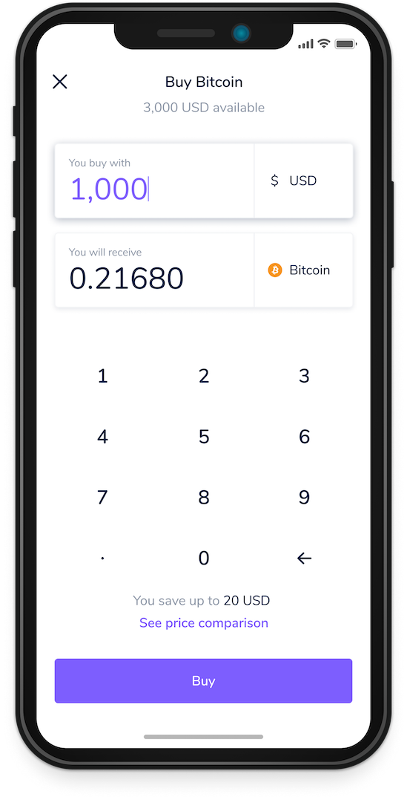

# Flipay Code Challenge

We believe one of the best ways to understand the engineering team fit is to see the solution and thought process on the problem. Please develop the solution with **Elixir, Golang, Ruby or NodeJS** and send us the link to your repository to career@flipay.co

## Challenge

### Context



You got into the team which is building the cryptocurrency exchange platform for users. The users can use the platform to buy and sell cryptocurrency through any existing exchanges.

The team got the idea to let users buy and sell at the best rate by selecting the exchange with the best rate at the time. And you took the challenge to develop this rate comparing application to plug to the existing application as in the image on the right.

### Requirements

The scope of the challenge is to build the application or library to able to determine the rate of buying and selling from the Coinbase Pro cryptocurrency exchange. Comparing rate is not included in the scope. And the new exchanges can be added later on.

The application will receive these input

1. Exchange name (will be only "coinbase_pro" for now)
2. Input asset
3. Input amount
4. Output asset

And expect to send the output

1. Average Price
2. Timestamp

The possible "Input-Output assets" are `BTC-USD`, `ETH-USD`. And it can be reversed. Which means we have 4 combinations (2 pairs and reverse of 2 pairs) of input and output assets.

"Input Amount" will always be the same currency as "Input Asset". For example, a user wants to buy BTC using 1,000 USD. The input will be like this. (This input is a sample, no need to implement this exact input).

```json
{
  "exchange_name": "coinbase_pro",
  "input_asset": "USD",
  "input_amount": 1000,
  "output_asset": "BTC"
}
```

### How to calculate Average Price?

The "Average Price" in the output will be determined by the ratio of input and output amount in USD. In the case of `BTC-USD`, it will be the number of `USD amount / BTC amount`. And the output amount will be determined by active orders in the order book.

Note that the reason we need "Input amount" is because the "Average Price" can vary depends on how much input amount users give.

Don't worry if this confused you, you can take a look at our explanation in [Understanding exchange price calculation](./docs/understanding-exchange-price.md).

### Resources

See [Coinbase Pro documentation](https://docs.pro.coinbase.com) for integration reference. Look at [Product Order Book](https://docs.pro.coinbase.com/#get-product-order-book) section for the market order data.

## Our Expectation

We expected to see the production-leveled code with proper testing. We have no development time requirement, so you can take a reasonable time to work on this challenge to show us your capability.

And we value these principles in the development.

**• Security.** To build trust in the product, security is the most important aspect. A financial company can go out of business in a single attack.  
**• Simplicity.** It is easy to build complex things. We should strive for simplicity so that we can maintain the speed of change.  
**• Clarity.** In the team collaboration, we rarely have the exact same context in the communication. Writing code with a clear objective and good readability help team effectiveness.  
**• Reliability.** What can go wrong, will go wrong. But not with the system which has been through the well-thought process of risk and error management.

Certainly, we never expected anything to be perfect, we need to be fast to maximize the learning to be able to maximize the values we can deliver to the world. And feel free to be creative on the solution as long as it satisfies the objective of the application.

For any questions, feel free to discuss in Github issue section, or send us the email at career@flipay.co
