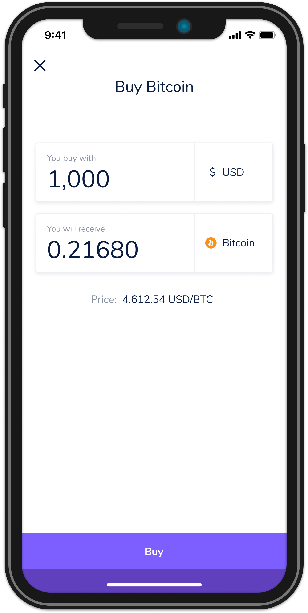

# Flipay Mobile Code Challenge

We believe one of the best ways to understand the engineering team fit is to see the solution and thought process on the problem. Please develop the solution with **iOS or Android** platform and send us the link to your repository to career@flipay.co

## Challenge

### Context

The project is in the early stage and need to test the idea with real users. 

We have the assumption that existing cryptocurrency application to buy and sell cryptocurrency without the knowledge about bid and offer.

You got into the team which is building the easy-to-use cryptocurrency trading application.

The team had an idea to display users the expected output of buying and selling before submitting the order as in the mockup image. 

### Requirements

The scope of the challenge is to build a 1-screen mobile application that can determine the rate of buying Bitcoin from the Coinbase Pro cryptocurrency exchange by using its Restful API.

The output and price should be updated every 5 seconds.

** Objective **

To test whether investors feel good about the experience interact with the trading system.

**More Details**

The application is expected to receive "Input Amount" in USD from users.  

And expect to display these output,

1. Output Amount (in BTC)
2. Average Price (USD)

User

Please note that in the future, the users will also be able to buy and sell other cryptocurrencies than Bitcoin.

### How to calculate Average Price?

The "Average Price" in the output will be determined by the ratio of input and output amount in USD. In the case of `BTC-USD`, it will be the number of `USD amount / BTC amount`. And the output amount will be determined by active orders in the order book.

Note that "Average Price" can vary depends on how much "Input Amount" users give.

Don't worry if this confused you, you can take a look at our explanation in [Understanding exchange price calculation](./docs/understanding-exchange-price.md).

### Resources

See [Coinbase Pro documentation](https://docs.pro.coinbase.com) for integration reference. Look at [Product Order Book](https://docs.pro.coinbase.com/#get-product-order-book) section for the market order data.

## Our Expectation

We expect to see the maintainable code with proper testing so that we can expand to test more. We have no development time requirement, so you can take a reasonable time to work on this challenge to show us your capability.

And we value these principles in the development.

**• Security.** To build trust in the product, security is the most important aspect. A financial company can go out of business in a single attack.  
**• Simplicity.** It is easy to build complex things. We should strive for simplicity so that we can maintain the speed of change.  
**• Clarity.** In the team collaboration, we rarely have the same context in communication. Writing code with a clear objective and good readability help team effectiveness.  
**• Reliability.** What can go wrong, will go wrong. But not with the system which has been through the well-thought process of risk and error management.

Certainly, we never expected anything to be perfect, we need to be fast to maximize the learning to be able to maximize the values we can deliver to the world. And feel free to be creative on the solution as long as it satisfies the objective of the application.

For any questions, feel free to discuss in Github issue section, or send us the email at career@flipay.co
